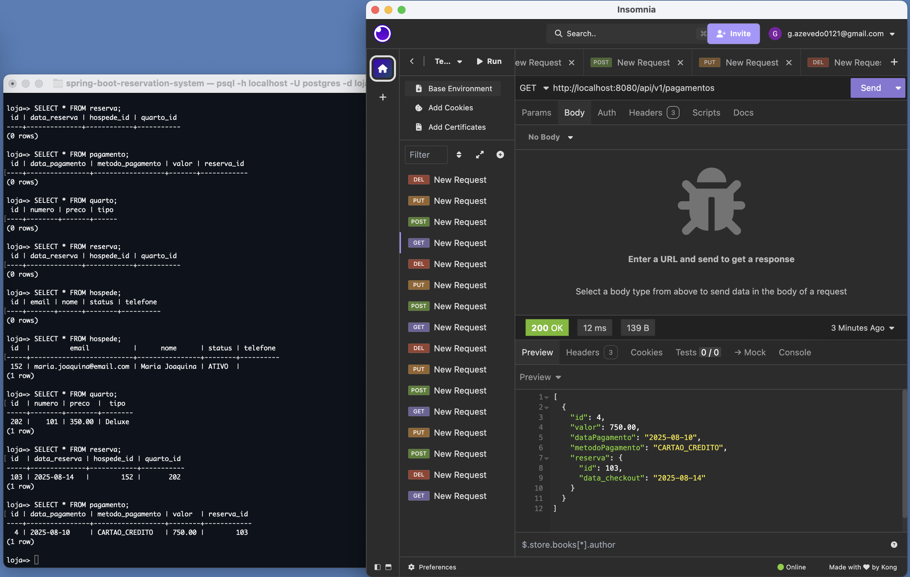

# CRUD de Hospedagem - API REST com Spring Boot e PostgreSQL

Este projeto é uma aplicação CRUD (Create, Read, Update, Delete) desenvolvida em Java utilizando o framework Spring Boot e integrada ao banco de dados PostgreSQL. A aplicação permite o gerenciamento de hóspedes, quartos, reservas e pagamentos em um sistema de hospedagem.

## Sumário

- [Tecnologias Utilizadas](#tecnologias-utilizadas)
- [Papel de Cada Framework](#papel-de-cada-framework)
- [Estrutura do Projeto (MVC)](#estrutura-do-projeto-mvc)
- [Como Executar Localmente](#como-executar-localmente)
- [Testes com Insomnia](#testes-com-insomnia)
- [Correção de Problemas Comuns](#correção-de-problemas-comuns)
- [Verificação no Terminal (PostgreSQL)](#verificação-no-terminal-postgresql)
- [Explicação dos Códigos](#explicação-dos-códigos)
- [Autor](#autor)

---

## Tecnologias Utilizadas

- Java 21 (OpenJDK)
- Spring Boot 3.5.4
- Spring Data JPA
- PostgreSQL
- Maven
- Insomnia (para testes da API)
- Lombok
- HikariCP (pool de conexões)
- Jackson (para serialização JSON)

---

## Papel de Cada Framework

- **Spring Boot**: estrutura principal do projeto, responsável pela configuração automática e inicialização da aplicação.
- **Spring Data JPA**: simplifica o acesso ao banco de dados com repositórios JPA.
- **Lombok**: gera automaticamente getters, setters e construtores, reduzindo o boilerplate.
- **PostgreSQL**: banco de dados relacional utilizado para persistência das entidades.
- **HikariCP**: gerenciador de conexões de banco de dados com alta performance.
- **Insomnia**: cliente REST utilizado para testar os endpoints da API.
- **Jackson**: biblioteca padrão do Spring para serialização e desserialização de objetos JSON.

---

## Estrutura do Projeto (MVC)
``` properties
src/
└── main/
├── java/
│ └── com.crud02.crud02/
│ ├── controller/ # Camada de controle da API (HTTP)
│ ├── model/ # Entidades JPA (tabelas)
│ ├── repository/ # Interfaces para acesso ao banco (JPA)
│ ├── service/ # Lógica de negócios
│ └── Crud02Application # Classe principal da aplicação
└── resources/
├── application.properties # Configuração do banco e da aplicação
```
---

## Como Executar Localmente

### 1. Clonar o repositório

```bash
git clone https://github.com/seuusuario/crud02.git
cd crud02
```
### 2. Configurar o banco de dados PostgreSQL
Certifique-se de que o PostgreSQL está rodando e crie o banco:
```bash
psql -U postgres
CREATE DATABASE loja;
```
### 3. Configuração no arquivo application.properties
```bash
spring.datasource.url=jdbc:postgresql://localhost:5432/loja
spring.datasource.username=postgres
spring.datasource.password=banco

spring.jpa.hibernate.ddl-auto=update
spring.jpa.database-platform=org.hibernate.dialect.PostgreSQLDialect
```
### 4. Build e execução da aplicação
```bash
./mvnw clean install
./mvnw spring-boot:run
```
* A aplicação estará disponível em: * 
```bash
http://localhost:8080
```
## Testes com Insomnia

### Hospede (CRUD Completo)

#### Criar
**POST** `/api/v1/hospedes`  
**JSON**
```json
{
  "nome": "Maria Silva",
  "email": "maria@email.com",
  "telefone": "34999999999"
}
```

#### Listar todos
**GET** `/api/v1/hospedes`

#### Buscar por ID
**GET** `/api/v1/hospedes/{id}`

#### Atualizar
**PUT** `/api/v1/hospedes/{id}`  
**JSON**
```json
{
  "nome": "Maria Joaquina",
  "email": "maria.joaquina@email.com"
}
```

#### Deletar
**DELETE** `/api/v1/hospedes/{id}`

---

### Quarto (CRUD Completo)

#### Criar
**POST** `/api/v1/quartos`  
**JSON**
```json
{
  "numero": 101,
  "tipo": "Casal",
  "preco": 200.00
}
```

#### Listar todos
**GET** `/api/v1/quartos`

#### Buscar por ID
**GET** `/api/v1/quartos/{id}`

#### Atualizar
**PUT** `/api/v1/quartos/{id}`  
**JSON**
```json
{
  "numero": 101,
  "tipo": "Deluxe",
  "preco": 350.00
}
```

#### Deletar
**DELETE** `/api/v1/quartos/{id}`

---

### Reserva (CRUD Completo)

> O id do hóspede e do quarto devem existir.

#### Criar
**POST** `/api/v1/reservas`  
**JSON**
```json
{
  "data_checkout": "2025-08-15",
  "quarto": { "id": 1 },
  "hospede": { "id": 1 }
}
```

#### Listar todas
**GET** `/api/v1/reservas`

#### Buscar por ID
**GET** `/api/v1/reservas/{id}`

#### Atualizar
**PUT** `/api/v1/reservas/{id}`  
**JSON**
```json
{
  "data_checkout": "2025-08-20",
  "quarto": { "id": 1 },
  "hospede": { "id": 1 }
}
```

#### Deletar
**DELETE** `/api/v1/reservas/{id}`

---

### Pagamento (CRUD Completo)

> O id da reserva deve existir.

#### Criar
**POST** `/api/v1/pagamentos`  
**JSON**
```json
{
  "valor": 750.00,
  "dataPagamento": "2025-08-10",
  "metodoPagamento": "CARTAO_CREDITO",
  "reserva": { "id": 1 }
}
```

#### Listar todos
**GET** `/api/v1/pagamentos`

#### Buscar por ID
**GET** `/api/v1/pagamentos/{id}`

#### Atualizar
**PUT** `/api/v1/pagamentos/{id}`  
**JSON**
```json
{
  "valor": 750.00,
  "dataPagamento": "2025-08-10",
  "metodoPagamento": "PIX",
  "reserva": { "id": 1 }
}
```

#### Deletar
**DELETE** `/api/v1/pagamentos/{id}`

---

## Demonstração da API

Todos os testes de CRUD foram realizados com sucesso. A captura de tela abaixo serve como confirmação, demonstrando a API em funcionamento e a integridade dos dados no terminal do PostgreSQL e no Insomnia.



---


## Verificação no Terminal (PostgreSQL)

### Acesse o PostgreSQL:

```bash
psql -h localhost -U postgres -d loja
```

### Listar tabelas:

```sql
\dt
```

### Consultar todos os hóspedes:

```sql
SELECT * FROM hospede;
```

### Consultar quartos:

```sql
SELECT * FROM quartos;
```

### Consultar reservas:

```sql
SELECT * FROM reserva;
```
### Consultar pagamentos:

```sql
SELECT * FROM pagametos;
```

### Sair:

```sql
\q
```

---
## Correção de Problemas Comuns

Durante o desenvolvimento, identifiquei e corrigi alguns erros importantes:

### 1. Loop de Serialização Infinito

Ao tentar realizar requisições **GET**, a API retornava um JSON em loop infinito.  
Isso ocorria devido a um relacionamento bidirecional entre as entidades  
(`Quarto -> Reserva -> Hospede -> Reserva`, etc.), que causava um **StackOverflowError**.

**Solução:**  
O problema foi resolvido usando as anotações do **Jackson** para controlar a serialização:

- `@JsonManagedReference`: Usada no lado **"pai"** do relacionamento (ex.: na lista de reservas dentro da classe `Quarto`), para indicar que este é o lado que deve ser serializado.
- `@JsonBackReference`: Usada no lado **"filho"** (ex.: no atributo `quarto` dentro da classe `Reserva`), para indicar que este lado deve ser ignorado durante a serialização, quebrando o loop.

---

### 2. Erro 415 "Unsupported Media Type"

O servidor retornava este erro em requisições **POST** mesmo com um JSON válido.

**Solução:**  
O problema não estava no código, mas na forma como a requisição era enviada.  
Era necessário garantir que o cabeçalho:

```
Content-Type: application/json
```

fosse incluído, o que foi resolvido configurando corretamente a ferramenta de testes (**Insomnia**) ou usando o comando **cURL**.


---
## Explicação dos Códigos

### `model/`
Contém as entidades **JPA**:

- **Hospede**: representa os hóspedes, com relação **1:N** com `Reserva`.
- **Quarto**: representa os quartos disponíveis.
- **Reserva**: representa a reserva de um quarto por um hóspede, com relacionamento `@ManyToOne` para ambos.
- **Pagamento**: representa os pagamentos feitos para uma reserva.

---

### `repository/`
Interfaces **JPA** que estendem `JpaRepository`, permitindo operações como:

- `findAll()`
- `save()`
- `deleteById()`

Tudo isso sem precisar implementar nada manualmente.

---

### `service/`
Contém as regras de negócio e faz a intermediação entre os **controllers** (camada web) e o acesso ao banco de dados.

---

### `controller/`
Expõe os *endpoints REST* da aplicação via anotações como `@GetMapping` e `@PostMapping`, permitindo que clientes interajam com a API através de requisições *HTTP*.
---

### Autor: 
* Gabriel Azevedo - Graduando em Engenharia de Computação * 
* Email: gazevedo.ti@gmail.com * # spring-boot-reservation-system
